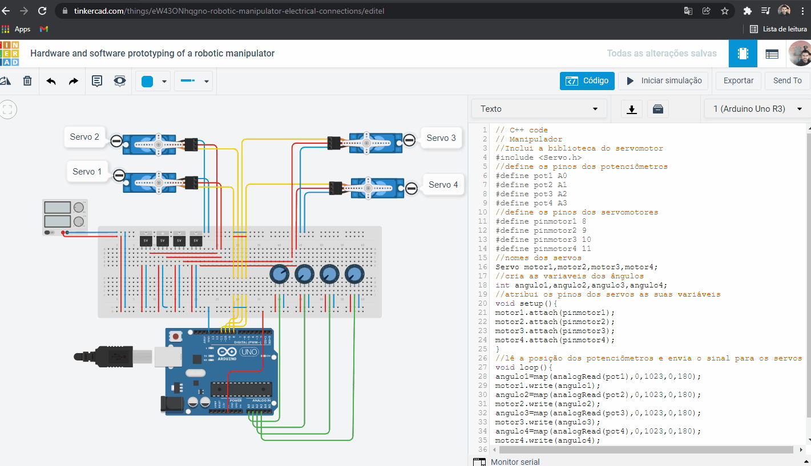

<h1 align="center">
  
   
  Hardware and software prototyping of a robotic manipulator - Veersion with Potentiometer
</h1>

<h3 align="justify">
Demonstration of electronically prototyped hardware and software aiming at the functionality of a robotic manipulator using AutoDesk TinkerCad application and C programming language. Credits for an integrated project of the Electrical Engineering Integrator Project subject of the Electrical Engineering course at Universidade Cruzeiro do Sul.
</h3>

 

## 📷 Demonstration

<h4 align="left"></h4>
  

 

## 🚀 Technologies

This project was developed with the following technologies:

- C
- TinkerCAD

## ⚙ Sources and Documentation
- https://www.tinkercad.com/
- https://www.arduino.cc/

 

Made with 💜 by Rafael Maciel
